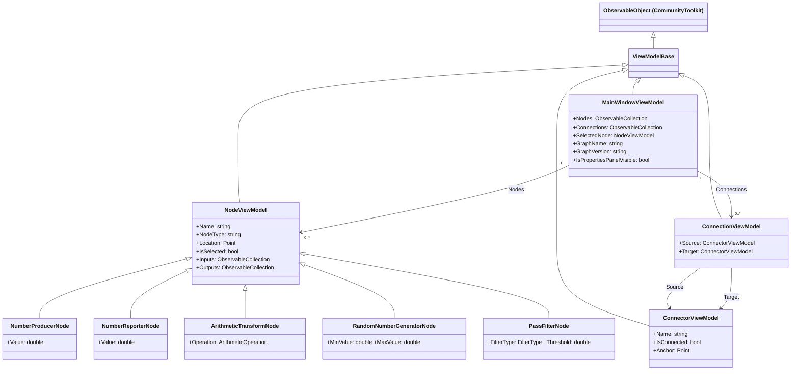

# Architecture — Avalonia Node Editor

This document describes the project structure, architecture layers, and key design decisions for the
Avalonia Node Editor. It is intended to give an AI agent (or new contributor) a complete picture of the
codebase without needing to read every source file.

## Table of Contents

- [Overview](#overview)
- [Tech Stack](#tech-stack)
- [Directory Structure](#directory-structure)
- [Architecture Layers](#architecture-layers)
  - [Models Layer](#models-layer)
  - [ViewModels Layer](#viewmodels-layer)
  - [Views Layer](#views-layer)
- [Node Types](#node-types)
- [Connection Rules](#connection-rules)
- [Serialization Format](#serialization-format)
- [UI Structure](#ui-structure)
- [Build and Test Commands](#build-and-test-commands)
- [CI/CD](#cicd)
- [Key Constraints and Pitfalls](#key-constraints-and-pitfalls)

---

## Overview

| Property | Value |
| -------- | ----- |
| **Name** | Avalonia Node Editor |
| **Repository** | `lunarcloud/example-node-code` |
| **Purpose** | Cross-platform desktop application for visual node-based graph editing |
| **Pattern** | MVVM (Model-View-ViewModel) with compiled bindings enabled by default |
| **Test Framework** | xUnit with `Avalonia.Headless.XUnit` |

---

## Tech Stack

| Component | Package / Version |
| --------- | ----------------- |
| Language | C# 12 |
| Runtime | .NET 10.0 |
| UI Framework | Avalonia UI 11.3.12 |
| Node Canvas | NodifyM.Avalonia 1.1.9 |
| MVVM Helpers | CommunityToolkit.Mvvm 8.4.0 |
| Ribbon Control | AvaloniaControls.Ribbon.Flowery 2026.2.13 |

---

## Directory Structure

```text
AvaloniaNodeEditor.slnx                       – XML-based solution file
requirements.yaml                              – Application requirements (ANE-REQ-001 … ANE-REQ-006)
src/AvaloniaNodeEditor/
  Program.cs                                   – Entry point; BuildAvaloniaApp() + UseReactiveUI()
  App.axaml / App.axaml.cs                    – Application styles/resources, ViewLocator data template
  ViewLocator.cs                               – Maps ViewModel type names to View types
  app.manifest                                 – Windows application manifest
  Assets/
    Fonts/NotoSansSymbols2-Regular.ttf         – Embedded font for ribbon icons
    avalonia-logo.ico                          – Application icon
  Models/
    GraphData.cs                               – DTOs: GraphData, NodeData, LayoutData, ConnectionData
    GraphJsonContext.cs                        – System.Text.Json source-generated context (AOT-safe)
    ArithmeticTransformNode.cs                 – Node: inputs A & B, output Result, configurable operation
    ArithmeticOperation.cs                     – Enum: Add, Subtract, Multiply, Divide
    ArithmeticOperationValues.cs               – Display names for ArithmeticOperation values
    NumberProducerNode.cs                      – Node: no inputs, one output, produces a constant double
    NumberReporterNode.cs                      – Node: one input, no outputs, displays received value
    PassFilterNode.cs                          – Node: one input, one output, LowPass/HighPass/MidPass
    FilterType.cs                              – Enum: LowPass, HighPass, MidPass
    FilterTypeValues.cs                        – Display names for FilterType values
    RandomNumberGeneratorNode.cs               – Node: no inputs, one output, random double in [Min, Max]
  ViewModels/
    ViewModelBase.cs                           – Base class; extends ObservableObject
    NodeViewModel.cs                           – Abstract base: Name, NodeType, Location, IsSelected,
                                                 Inputs, Outputs
    ConnectorViewModel.cs                      – Single connector: Name, IsConnected, Anchor position
    ConnectionViewModel.cs                     – Directed edge: Source → Target (ConnectorViewModel)
    MainWindowViewModel.cs                     – Orchestrator: Nodes, Connections, SelectedNode,
                                                 GraphName, GraphVersion, IsPropertiesPanelVisible,
                                                 ToolboxItems; all graph commands and serialization
  Views/
    MainWindow.axaml / .axaml.cs              – Main window: ribbon, NodifyEditor canvas, properties panel
    AboutDialog.axaml / .axaml.cs             – Simple About dialog
tests/AvaloniaNodeEditor.Tests/
  AvaloniaNodeEditor.Tests.csproj
  Models/
    ArithmeticTransformNodeTests.cs
    NumberProducerNodeTests.cs
    NumberReporterNodeTests.cs
    PassFilterNodeTests.cs
    RandomNumberGeneratorNodeTests.cs
  ViewModels/
    MainWindowViewModelTests.cs
```

---

## Architecture Layers

### Layer Diagram



### Models Layer

Located in `src/AvaloniaNodeEditor/Models/`.

- Concrete node classes **inherit** from `NodeViewModel` (defined in `ViewModels/`).
- Every node class is `partial` and uses `[ObservableProperty]` from CommunityToolkit.Mvvm for
  auto-generated property change notification.
- **Serialization DTOs** live in `GraphData.cs`:
  - `GraphData` — top-level; contains `Name`, `Version`, `Nodes`, `Layout`, `Connections`.
  - `NodeData` — name, type string, and type-specific scalar fields.
  - `LayoutData` — X/Y canvas position.
  - `ConnectionData` — `From` and `To` strings in the format `"NodeName.ConnectorName"`.
- `GraphJsonContext.cs` provides a source-generated `System.Text.Json` serializer context that is
  AOT-safe and avoids runtime reflection.

### ViewModels Layer

Located in `src/AvaloniaNodeEditor/ViewModels/`.

- `ViewModelBase` — thin base class extending `ObservableObject`.
- `NodeViewModel` (abstract) — defines the shared surface for all nodes; concrete types live in
  `Models/`.
- `ConnectorViewModel` — represents one input or output port; tracks `IsConnected` and the canvas
  `Anchor` point used by NodifyM.Avalonia to draw connection lines.
- `ConnectionViewModel` — immutable Source→Target pair; owns no mutable state.
- `MainWindowViewModel` — central orchestrator that:
  - Owns `Nodes` and `Connections` as `ObservableCollection<T>`.
  - Exposes commands: `AddNode`, `NewGraph`, `Quit`, `ConnectionCompleted`, `RemoveConnection`,
    `DisconnectConnector`, `CopyNode`, `PasteNode`, `DeleteNode`.
  - Implements `SerializeGraph` / `DeserializeGraph` for JSON round-trips.
  - Generates unique node names via `GenerateUniqueName(nodeType)`.
  - Validates names on every `PropertyChanged` via `TrackNodeName`; sets `HasNameError = true` on
    duplicates.

### Views Layer

Located in `src/AvaloniaNodeEditor/Views/`.

- **`MainWindow.axaml`** — top-level layout:
  - Ribbon toolbar (AvaloniaControls.Ribbon.Flowery) with File / Edit / Nodes / View / Help tab groups.
  - A `<Border ClipToBounds="True">` wrapper that contains the `NodifyEditor` canvas *(see pitfall #1)*.
  - A right-side properties panel whose visibility is bound to `IsPropertiesPanelVisible`.
- **Ribbon icons** are Unicode code points rendered with the embedded `NotoSansSymbols2-Regular.ttf`
  font (resource key `NotoSymbolsFont`).
- **NodifyEditor bindings** that must be present:
  - `ConnectionCompletedCommand` → `MainWindowViewModel.ConnectionCompleted`
  - `RemoveConnectionCommand` → `MainWindowViewModel.RemoveConnection`
  - `DisconnectConnectorCommand` → `MainWindowViewModel.DisconnectConnector`
  - Node `Location` and `IsSelected` bindings require `Mode=TwoWay`.
- **Connector templates**: `InputConnectorTemplate` (dot on the left, label on the right) and
  `OutputConnectorTemplate` (label on the left, dot on the right).
- **Gallery drag-to-canvas**: the `Loaded` event wires `PointerPressed` / `PointerMoved` /
  `PointerReleased` handlers; the `Tag` property on each gallery item holds the node type string;
  the drag activation threshold is 4 px; handlers must be registered with
  `handledEventsToo: true` because `GalleryItem` (a `ListBoxItem`) marks `PointerPressed` as handled.
- **`MainWindow.axaml.cs`** handles file save/load through `StorageProvider`, maps
  `Ctrl+S` / `Ctrl+O` shortcuts, and converts drop position to canvas coordinates via
  `OffsetX` / `OffsetY`.
- **Compiled bindings**: every XAML element that uses bindings requires an `x:DataType` attribute.

---

## Node Types

| Type | Inputs | Outputs | Key Properties |
| ---- | ------ | ------- | -------------- |
| Number Producer | — | Output | `Value: double` (constant) |
| Number Reporter | Input | — | `Value: double` (received) |
| Arithmetic Transform | A, B | Result | `InputA`, `InputB`, `Result`, `Operation` (Add/Subtract/Multiply/Divide) |
| Random Number Generator | — | Output | `MinValue`, `MaxValue`, `Value` |
| Pass Filter | Input | Output | `InputValue`, `OutputValue`, `FilterType`, `Threshold`, `UpperThreshold` |

### Node Naming

- Default name: `"{NodeType} N"` where N is the first available integer starting from 1.
- `NodeViewModel.HasNameError` is set to `true` when the name duplicates another node in the graph.
- Name validation runs on every `PropertyChanged` event via `TrackNodeName`.

---

## Connection Rules

- Connections flow **output → input** only; reversed drags are auto-swapped by the ViewModel.
- Each input connector accepts **at most one** incoming connection (fan-in = 1).
- Output connectors can fan out to multiple inputs (fan-out = N).
- **Alt+Click a connection line** → invokes `RemoveConnectionCommand` (requires
  `BaseConnection.DisconnectCommand` to be bound; see pitfall #4).
- **Alt+Click a connector** → invokes `DisconnectConnectorCommand`, removing all connections on that
  connector.

---

## Serialization Format

Graph state is saved to / loaded from JSON with the following shape:

```json
{
  "name": "optional graph name",
  "version": "optional version string",
  "nodes": [
    { "name": "Number Producer 1", "type": "Number Producer", "value": 42.0 }
  ],
  "layout": {
    "Number Producer 1": { "x": 100, "y": 200 }
  },
  "connections": [
    { "from": "Number Producer 1.Output", "to": "Number Reporter 1.Input" }
  ]
}
```

- Connection references use the format `"NodeName.ConnectorName"`.
- Serialization is performed by `MainWindowViewModel.SerializeGraph` / `DeserializeGraph` using the
  source-generated `GraphJsonContext`.

---

## UI Structure

### Ribbon Tabs

| Tab | Buttons / Groups |
| --- | ---------------- |
| File | New Graph, Save, Open, Quit |
| Edit | Copy Node, Paste Node, Delete Node |
| Nodes | Gallery (drag-to-canvas for each node type) |
| View | Toggle Properties Panel, Graph Info flyout |
| Help | About dialog |

### Theme Resources (defined in `App.axaml`)

| Resource Key | Light Value | Dark Value |
| ------------ | ----------- | ---------- |
| `PanelBackgroundBrush` | `#F3F3F3` | `#1E1E1E` |
| `PanelBorderBrush` | `#CCCCCC` | `#3A3A3C` |
| `NodeBackgroundBrush` | (see App.axaml) | (see App.axaml) |
| `NodeBorderBrush` | (see App.axaml) | (see App.axaml) |

### Styles

- Fluent theme
- NodifyM.Avalonia control styles
- Ribbon control styles
- `TextBox.nameError` selector: sets `BorderBrush=Red` when a node name is duplicated.

---

## Build and Test Commands

```bash
# Build
dotnet build --configuration Release

# Test
dotnet test --configuration Release --logger "console;verbosity=detailed"

# Format
dotnet format

# Lint (Linux/macOS) — markdownlint, cspell, yamllint
./lint.sh
```

---

## CI/CD

| Workflow | Trigger | Purpose |
| -------- | ------- | ------- |
| `build.yaml` | Push / PR | Multi-platform build (Windows + Linux) |
| `build_on_push.yaml` | Push | Additional push-triggered build checks |
| `release.yaml` | Tagged release | NuGet publish |
| CodeQL | Schedule / Push | Security scanning |

**Linting tools and configuration files:**

| Tool | Config File |
| ---- | ----------- |
| markdownlint | `.markdownlint.json` |
| cspell | `.cspell.json` |
| yamllint | `.yamllint.yaml` |

Tests use xUnit with `Avalonia.Headless.XUnit`; test projects are in
`tests/AvaloniaNodeEditor.Tests/`.

---

## Key Constraints and Pitfalls

1. **`ClipToBounds` on a wrapper `<Border>`** — `NodifyEditor` must be wrapped in
   `<Border ClipToBounds="True">`; setting `ClipToBounds` directly on the editor itself is not
   sufficient.

2. **`TwoWay` bindings for Location and IsSelected** — Node `Location` and `IsSelected` bindings
   require `Mode=TwoWay`; without this the ViewModel is never updated when the user moves nodes or
   selects them.

3. **Do not mix `PendingConnection` commands with `ConnectionCompletedCommand`** — binding both
   `PendingConnection.StartedCommand` / `CompletedCommand` AND `ConnectionCompletedCommand` causes
   double-invocation.

4. **`BaseConnection.DisconnectCommand` must be bound** — Alt+Click on a connection line only works
   when `DisconnectCommand` is bound to `RemoveConnectionCommand`; a null command silently ignores
   the gesture.

5. **`UseReactiveUI()` must not be removed** — `Program.cs` already calls `UseReactiveUI()` in
   `BuildAvaloniaApp()` and it must remain; AvaloniaControls.Ribbon.Flowery depends on it.

6. **Compiled bindings require `x:DataType`** — every XAML scope that uses `{Binding}` expressions
   with compiled bindings enabled must declare `x:DataType` on the root or the containing element.

7. **Gallery pointer events need `handledEventsToo: true`** — `GalleryItem` (a `ListBoxItem`)
   marks `PointerPressed` as handled; the drag handler registration must pass
   `handledEventsToo: true` to receive the event.
